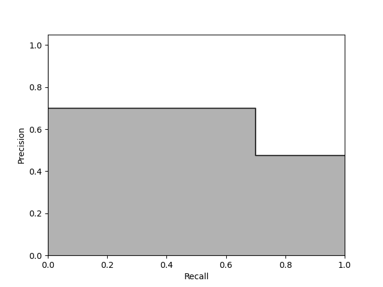
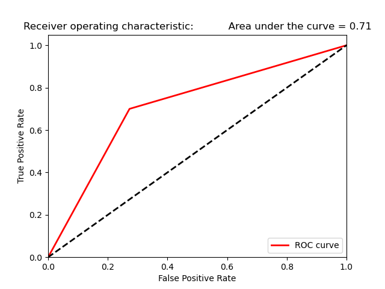

# Rock Mine Prediction

## Overview

This project aims to classify sonar returns as either rocks or mines using machine learning techniques. The dataset used is the Sonar Mines vs. Rocks dataset.

## Table of Contents

-   [Overview](#overview)
-   [Dataset](#dataset)
-   [Requirements](#requirements)
-   [Installation](#installation)
-   [Usage](#usage)
-   [Model](#model)
-   [Results](#results)
-   [Contributing](#contributing)
-   [License](#license)
-   [Acknowledgements](#acknowledgements)

## Dataset

The Sonar Mines vs. Rocks dataset is used in this project. It contains 208 instances with 60 features representing the energy of sonar signals reflected by various objects.

-   Features: 60 numeric features
-   Instances: 208
-   Classes: 2 (Rock and Mine)

## Requirements

-   Python 3.7+
-   NumPy
-   pandas
-   scikit-learn
-   Matplotlib
-   Seaborn

## Installation

1. Clone the repository:

    ```sh
    git clone https://github.com/cafesuada24/ML-Rock-Mine-Prediction.git
    cd ML-Rock-Mine-Prediction
    ```

2. Install the required packages:
    ```sh
    pip install -r requirements.txt
    ```

## Usage

-   Train the model:

    ```sh
    python train_model.py
    ```

-   Predict the classification of new data:
    ```sh
    python src\RockMinePrediction.py --data "Your data here"
    ```

## Model

The model used in this project is a neural network built with TensorFlow. It consists of several dense layers with ReLU activation functions and a final output layer with a sigmoid activation function. The model is trained to minimize binary cross-entropy loss and optimized using the Adam optimizer.

## Results

The model achieves an accuracy of 71% on the test dataset. Below is the confusion matrix and classification report:





## Contributing

Contributions are welcome! Please open an issue or submit a pull request.

## License

This project is licensed under the MIT License. See the [LICENSE](LICENSE) file for details.

## Acknowledgements

-   [UCI Machine Learning Repository](<https://archive.ics.uci.edu/ml/datasets/Connectionist+Bench+(Sonar,+Mines+vs.+Rocks)>) for providing the dataset.
-   [TensorFlow](https://www.tensorflow.org) for the machine learning framework.
